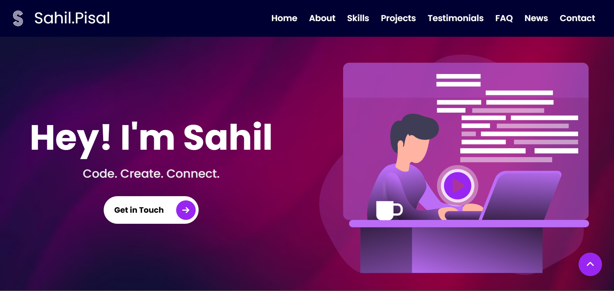

# 🌐 Personal Portfolio Website

---

## 📖 About

This is my **personal portfolio website** built with **Bootstrap 5** and **Sass (SCSS)**.  
It showcases my projects, skills, and contact details in a modern and responsive design.

---

## 🚀 Features

- 🎨 Clean and responsive UI
- 📱 Mobile-friendly design
- ⚡ Built with Bootstrap 5
- 🎭 Styled using Sass (SCSS)
- 📂 Sections: About, Skills, Projects, Contact

---

## 🔧 Tech Stack

- **HTML5**
- **CSS3 / Sass (SCSS)**
- **Bootstrap 5**
- **JavaScript**

---

## 📸 Screenshot

---

## 🌍 Live Demo

🚀 [View My Portfolio](https://sahilpisal03.github.io/My-Portfolio/)

---
